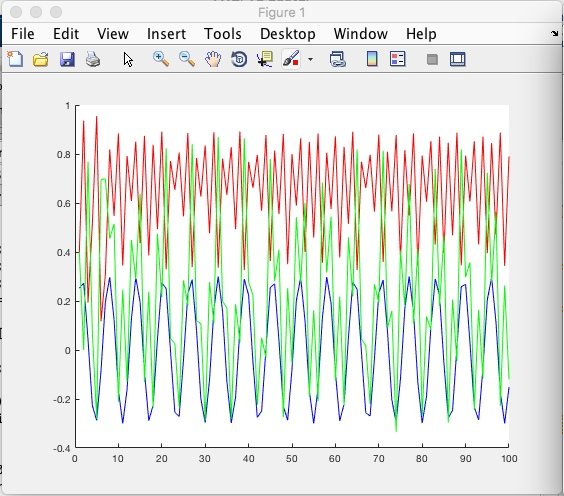
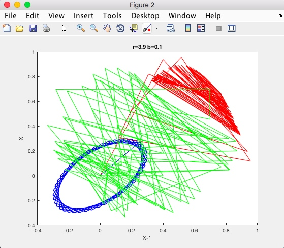

# Детерминированный хаос. Управление на многообразии
> Моделирование объектов детерминированного хаоса. Режимы устойчивости. Принципы системного синтеза управления и нелинейной адаптации на многообразиях

## Задание
1. Ознакомиться со справочными сведениями.
2. Построить графики и фазовые портреты нелинейной модели для
устойчивого и неустойчивого режимов.
3. Разработать программу, реализующую алгоритм управления хаотической
моделью с целью стабилизации объекта в окрестности устойчивого
состояния.
4. Получить сравнительные графики управляемой и неуправляемой моделей.
5. Составить и представить преподавателю отчет о работе.

Траектория модели Эно
Xn+1 = r * xn * (1 - xn) - b * xn - 1

При значениях **r = 3.9; b = 0.1; x0 = 0.4.**

Функция управления:
*x0k = 0.3 * sin(k)*

Закон управления дискретной моделью:
*xk(i) - r * x(i-1) * (1 - x(i-1)) - b * x(i-2)*

 - Красная – неуправляемый режим.
 - Синий – функция управления. 
 - Зеленый – управляемый режим.

#### Сравнительное моделирование

### Фазовые портреты
